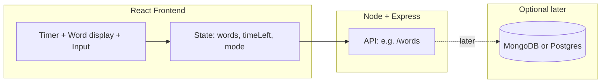

# Typephoon MVP: Stack choice and build plan

## PERN vs MERN – recommendation

**Recommendation: MERN (MongoDB, Express, React, Node)** for your situation.

| Factor                           | MERN                                                                                                                                  | PERN                                                                                       |
| -------------------------------- | ------------------------------------------------------------------------------------------------------------------------------------- | ------------------------------------------------------------------------------------------ |
| **Learning curve**               | MongoDB is JSON-like; no schema migrations to start.                                                                                  | PostgreSQL needs schema design and migrations from day one.                                |
| **Tutorial overlap**             | Very common; lots of “full stack MERN” material.                                                                                      | Also common; PERN is often “MERN with Postgres.”                                           |
| **This MVP**                     | You don’t need a DB for the core loop (words + timer + try again). Adding MongoDB later for leaderboards/settings is straightforward. | Same; Postgres would shine for strict relations (users, tests, scores) once you add those. |
| **Getting out of tutorial hell** | Slightly faster to get a working app (one less moving part if you defer DB).                                                          | Slightly more setup (DB + migrations) before “it works.”                                   |

**Important:** For this MVP you can **skip the database entirely** and still use the “MERN” idea: React frontend + Node/Express API. Add MongoDB (or Postgres) when you want persistence (e.g. leaderboards, user accounts, saved settings). That keeps the first milestone small and lets you focus on: React state, timers, word generation, and a minimal API.

If you prefer learning SQL and relations from the start, PERN is a good alternative; the rest of the plan works with either stack.

---

## MVP scope (what you’re building)

- **Random words** shown one-by-one (or in a line); user types until **time is up**.
- **Timer**: user chooses **30 seconds** or **60 seconds** before starting.
- **Try again**: after time’s up, a **“Try again”** control that lets the user either:
  - **Same words** – replay with the same word list, or  
  - **New words** – generate a new set and run again.

No auth, no leaderboards, no database required for this MVP.

---

## High-level architecture

- **Frontend (React):** Renders timer (30/60 selector + countdown), current/upcoming words, input field, and “Try again” (same words / new words). Holds state: word list, time left, “running” vs “finished,” etc.
- **Backend (Node + Express):** At minimum, an endpoint that returns a list of random words (e.g. from a word list file or array). You can keep the MVP with only this one route.
- **Database:** Omit for MVP; add when you want stored data.

---

## Suggested order of work (you build; AI teaches)

1. **Project setup**
  - Create repo with a `client` (React) and `server` (Node/Express) folder.
  - Get the React app running (e.g. Vite) and the Express server running (e.g. `node server` or `npm run dev`). Learn how they run separately and how the client will call the server (URL/port).
2. **Word list and API**
  - Put a simple word list in the server (e.g. a JSON file or array of strings).
  - Implement one GET route (e.g. `GET /api/words?count=50`) that returns N random words. Test with browser or Postman. You write the route; AI can explain `Math.random`, shuffling, and Express `res.json()`.
3. **Timer and duration choice**
  - In React: state for “duration” (30 or 60) and “time left.” A 30/60 selector (buttons or dropdown) that only applies before starting.
  - Implement countdown (e.g. `setInterval` or `setTimeout` that decrements “time left” every second and stops at 0). Learn about starting/clearing intervals and not leaking them on unmount.
4. **Core typing loop**
  - State: current word index, list of words, user input.
  - When user types, compare input to current word; on correct match (e.g. space or “submit”), advance to next word. Keep going until time runs out.
  - Display: current word (and maybe next few); show correctness (e.g. green/red) if you want. No backend needed for this; it’s all React state and event handlers.
5. **“Try again” (same vs new words)**
  - When time’s up: show a “Try again” section with two actions: “Same words” and “New words.”
  - **Same words:** Reset timer and word index, keep the same word list, start again.
  - **New words:** Call your `/api/words` again to get a new list, then reset timer and start with the new list.
  - This teaches: preserving vs replacing state and one async API call from React.
6. **Polish**
  - Basic styling, focus on input, disable input when time’s up, clear input when advancing word. Optional: simple WPM at the end (words completed / (duration in minutes)).

---

## Files and structure you’ll create

- **Server:** `server/package.json`, `server/index.js` (or `server.js`), `server/words.json` (or `words.js`) for the word list.
- **Client:** `client/` created with Vite + React; components for: timer/duration selector, word display, input, try-again buttons.
- **No DB or env files** until you add persistence.

---

## How to use AI as “senior dev, not coder”

- Ask: “How do I structure state for the timer and words?” instead of “Write the timer component.”
- Ask: “What’s the right way to fetch words from my API in React?” and implement the fetch yourself from the explanation.
- Ask: “How do I avoid setInterval leaking when the component unmounts?” and then write the cleanup.
- Request: “Review my Try Again logic and tell me what could break” rather than “Implement Try Again.”

You’ll learn the most by typing every line yourself and using AI for concepts, structure, and review.

---

## Summary

- **Use MERN** (and optionally defer MongoDB) so you can ship the MVP quickly and add a DB when you need it.
- **MVP:** Random words + 30/60s timer + try again (same words / new words); backend = one words API; no database.
- **Build order:** Project setup → words API → timer + duration → typing loop → try again (same/new) → polish.
- **Your role:** Implement each step; use AI for explanations, structure, and code review so you stay out of tutorial hell while still learning by doing.

